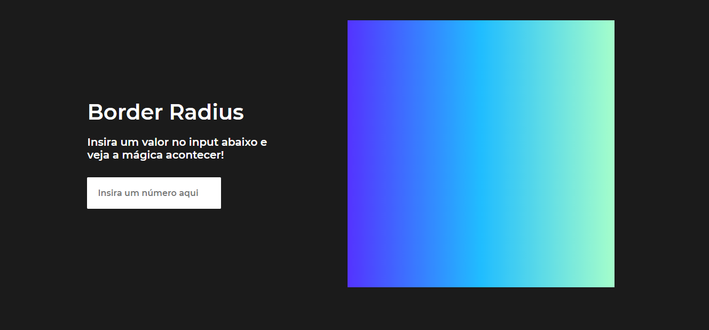

# Radius-Preview
<p align="center">

</p>

## Why
Based on project idea of [appideas](https://github.com/florinpop17/app-ideas) i create this aplication to summarize web concepts.

## Instalation

To use it,choose a folder where it will be cloned or repository, open the cmd / terminal and use the * git * command below:
```
git clone https://github.com/JuanGustah/Radius-Preview
```
After that,open the index.html with the browser of your choice.
